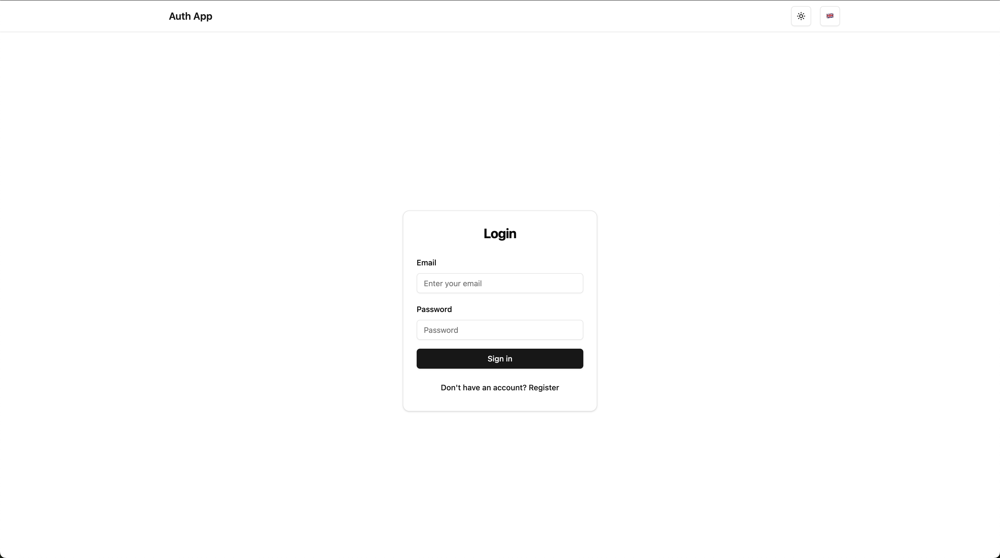
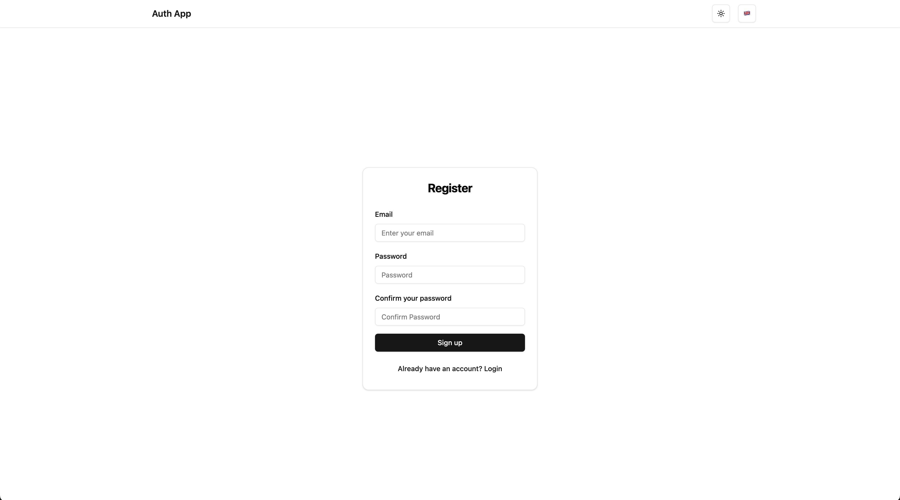
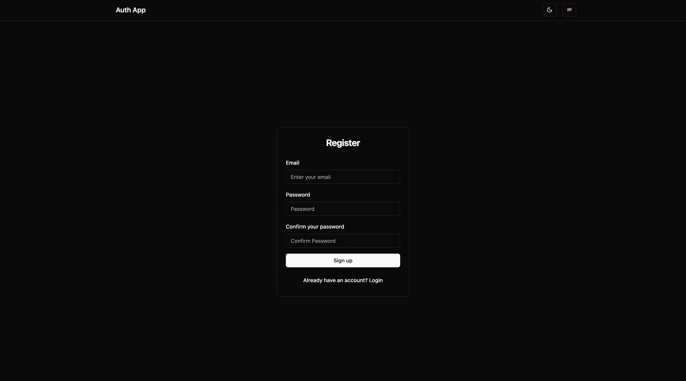
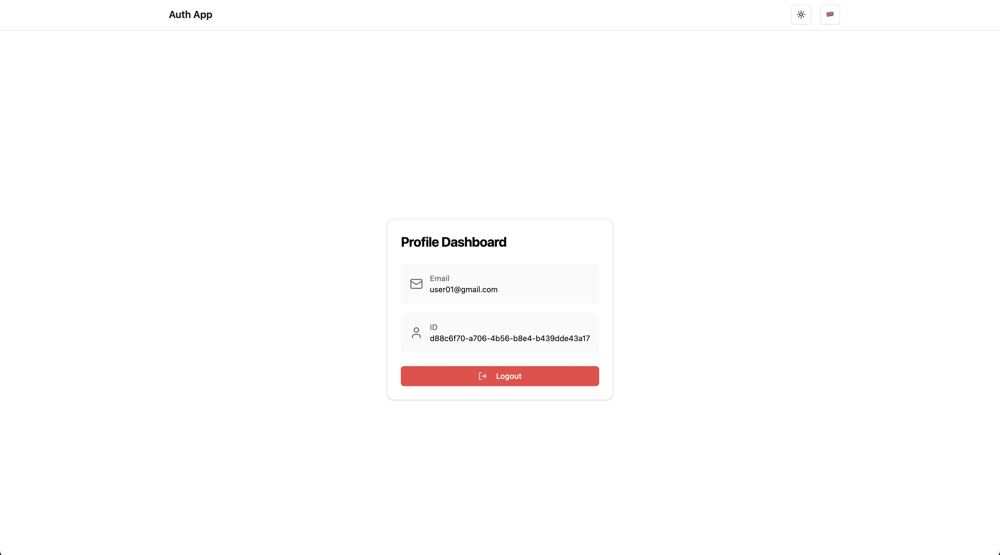
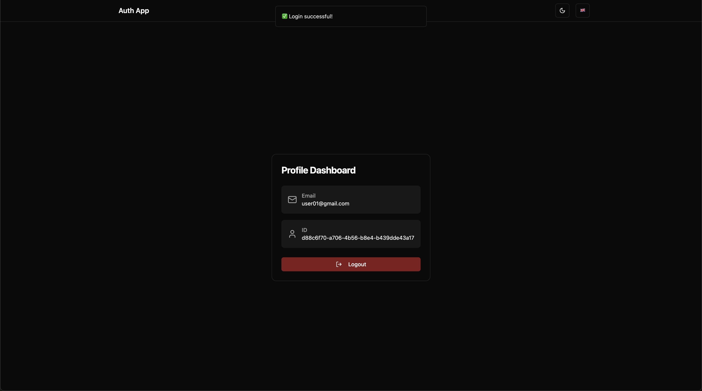
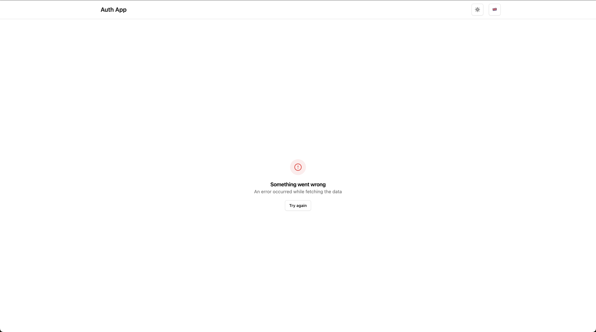
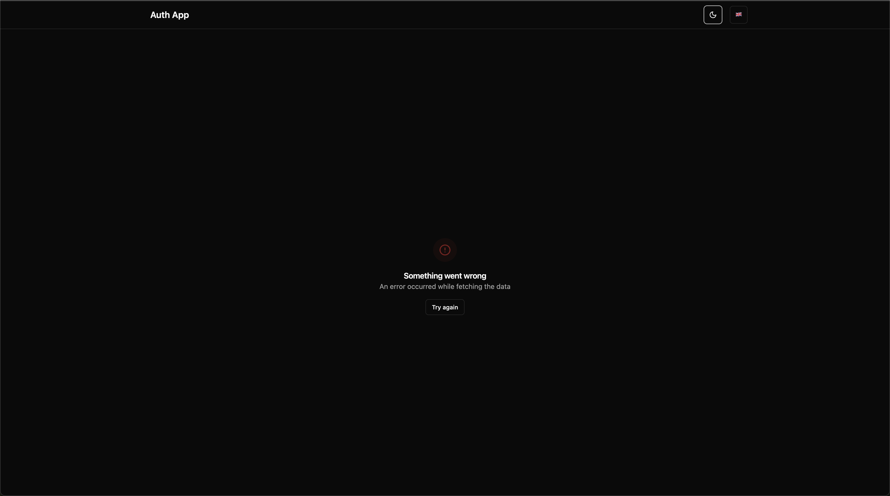

# Authentication App

## Overview
Authentication application built with Vite, React and TypeScript that provides secure user authentication with internationalization support.

## Features
- User Authentication: Secure login and registration functionality
- Form Validation: Comprehensive form validation with Zod
- Dark Mode: Built-in dark mode support
- Protected Routes: Secure route protection for authenticated users
- Internationalization: Supports English and Russian languages

## Setup Instructions

### Prerequisites
- Node.js (v16 or higher)
- npm or yarn

### Development Setup
1. Clone the repository
   ```bash
   git clone <repository-url>
   cd vite-auth

2. Install dependencies
   ```bash
   npm install
   # or
   yarn install

3. Start the development server
   ```bash
   npm run dev
   # or
   yarn dev

4. Open your browser and navigate to URL_ADDRESS:5173
   

## Tech Stack
- React 18.3.1
- TypeScript 5.6.2
- Vite 6.0.5
- TanStack Query 5.66.0
- Zod 3.24.1
- React Hook Form 7.54.2
- React-i18next 15.4.0
- Tailwind CSS 3.4.0
- Shadcn/ui 0.9.4
- Axios 1.7.9
- Framer Motion 12.0.6

## Features in Detail
### Authentication
- Secure login and registration
- Protected routes
- Token-based authentication
- Persistent sessions

### Internationalization
- English and Russian language support
- Dynamic content translation
- Translated form validations
- Language persistence

### UI/UX
- Responsive design
- Dark mode support
- Loading states
- Toast notifications
- Form validation feedback

## Project Structure
src/    
├── api/           
├── components/      
├── config/      
├── hooks/       
├── lib/         
├── pages/       
├── providers/   
├── routes/      
└── schemas/  


## Screenshots

### Authentication Pages

#### Light Mode
<p>
  
</p>

#### Dark Mode
<p>
  
</p>

### Registration Pages

#### Light Mode
<p>
  
</p>

#### Dark Mode
<p>
  
</p>

### Dashboard Pages

#### Light Mode
<p>
  
</p>

#### Dark Mode
<p>
  
</p>

### Error State

#### Light Mode
<p>
  
</p>

#### Dark Mode
<p>
  
</p>